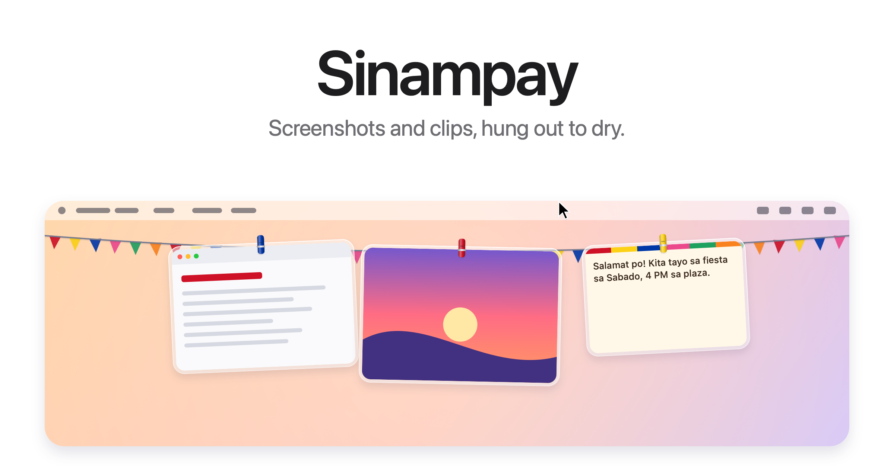
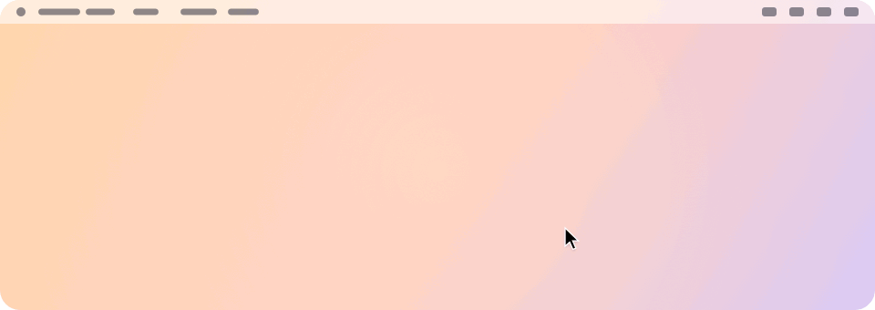
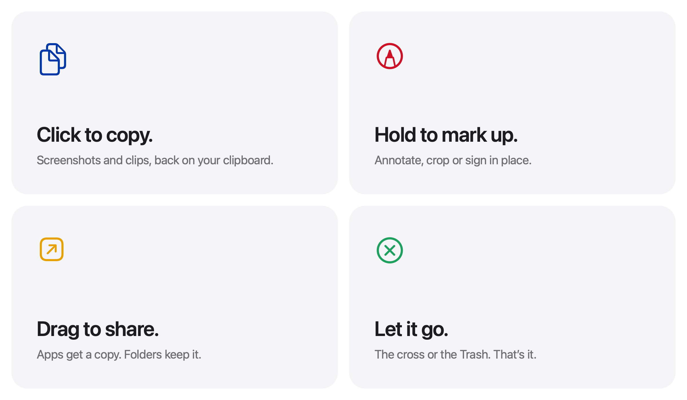

<picture>
  <source media="(prefers-color-scheme: dark)" srcset="docs/hero-dark.png">
  
</picture>

<p align="center">
  Free and open source. For macOS 14 and later.
  <br>
  <a href="#build-from-source">Build from source&nbsp;&rsaquo;</a>
</p>

<br>

## Isampay mo na.

*Sinampay* is Filipino for the laundry hung out to dry: the line of clothes
on every terrace and window from Batanes to Jolo, held by bright plastic
*sipit*.

Every screenshot you take, and everything you copy, hangs on a line just
above your screen. Rest the pointer in the menu bar and it glides down.
Move away and it's gone.

<picture>
  <source media="(prefers-color-scheme: dark)" srcset="docs/demo-dark.gif">
  
</picture>

<br>
<br>

## A gesture for everything.

<picture>
  <source media="(prefers-color-scheme: dark)" srcset="docs/bento-dark.png">
  
</picture>

<br>
<br>

| | |
|:--|:--|
| Click | Copy it back to the clipboard. |
| Press and hold | Open a screenshot in Markup, or a text clip in your editor. |
| Double click | Open it. |
| Drag into an app | Send a copy. It stays on the line. |
| Drag into a folder | Keep it there. It leaves the line. |
| Drag to the Trash, or click the cross | Let it go. |
| Rest the pointer in the menu bar | Bring the line down on that screen. |
| Click anything in the menu bar | Put it away. |
| <kbd>⌃</kbd>&thinsp;<kbd>⌥</kbd>&thinsp;<kbd>S</kbd> | Show or hide the line. Change it from the menu bar. |

<br>

## Screenshots and clipboard, on one line.

**Screenshots** hang the instant you take them. Hand Sinampay your
screenshots<sup>1</sup> and they skip the Desktop entirely: no floating
thumbnail, no five-second wait, and only what you drag out is kept.

**Clips** hang too. Copy some text or an image and it joins the line
quietly, without pulling it down over your work. Text hangs as a little note
on warm paper. Click it to copy it again. Anything your password manager
marks as private is never kept, and you can turn clipboard history off from
the menu bar.

<br>

## Para sa Pinoy.

- Plastic sipit in blue, red, yellow, green and pink, one per card.
- Fiesta banderitas strung along the line. They can be turned off.
- A sunset over Manila Bay for the icon.
- The app speaks Filipino, English and Spanish, following your Mac's language.

<br>

## Private by design.

No account. No network. No analytics. Sinampay runs entirely on your Mac.
Screenshots and clips never leave it. Clips are kept in
`~/Library/Application Support/Sinampay/Clipboard` while they hang, and are
deleted when they leave the line.

<br>

## Tech Specs

| | |
|:--|:--|
| **Compatibility** | macOS 14 Sonoma or later, on Apple silicon and Intel |
| **Languages** | Filipino, English, Spanish |
| **Built with** | Swift, AppKit and SwiftUI |
| **Network access** | None |
| **Price** | Free |
| **License** | MIT |

<br>

## Build from source

```sh
git clone https://github.com/<your-username>/sinampay.git
cd sinampay
scripts/build-app.sh
open build/Sinampay.app
```

Requires the Swift toolchain. Xcode is optional. Set `BUNDLE_ID` to a
reverse-DNS name you control (for example `io.github.<your-username>.Sinampay`)
before building for release. Local builds are signed ad hoc, so macOS asks
again for access to the Desktop, and to paste from other apps, after each
rebuild.

<details>
<summary>Inside the app</summary>
<br>

| File | Role |
|:--|:--|
| `AppDelegate.swift` | Menu bar, shortcut, revealing and tucking away the line |
| `LinePanel.swift` | The transparent strip along the top of the screen |
| `LineView.swift` | The line, the banderitas and where each card hangs |
| `PeggedView.swift` | One card: glass frame, sipit, swing and breeze |
| `Palette.swift` | The fiesta colours |
| `GrabArea.swift` | Click, long press, drag and drop, VoiceOver |
| `ScreenshotWatcher.swift` | Notices new screenshots |
| `Clipboard.swift` | Clipboard history and text notes |
| `Inbox.swift` | Takes over screenshot settings and always puts them back |
| `Markup.swift` | Opens the system Markup editor and saves the result |
| `FullScreen.swift` | Knows when to stay hidden |
| `HotKey.swift` | The global shortcut |
| `Line.swift` | What is hanging, and what you can do with it |

Every image here, the icon included, is drawn in code by
`scripts/make-icon.swift` and `scripts/make-readme-art.swift`.
`scripts/make-dmg.sh` builds the disk image for releases.

</details>

<br>

## Credits

Sinampay is a fork of [Tendedero](https://github.com/alejandrobujan/tendedero)
by [Alejandro Buján](https://alejandrobujan.com), whose code is MIT
licensed. The Tendedero name and icon belong to its author and are not used
here.

---

<sub>
1. On first launch, Sinampay offers to handle your screenshots. If you accept, it turns off the floating thumbnail and saves new screenshots to its own folder, two settings also found under Options in Cmd+Shift+5. Your previous settings are saved and restored when Sinampay quits, when the option is turned off from the menu bar, and on the next launch if the app ever crashes. If you pick another save location in Cmd+Shift+5, Sinampay follows your choice. Sinampay hides automatically while an app is in full screen.
</sub>
